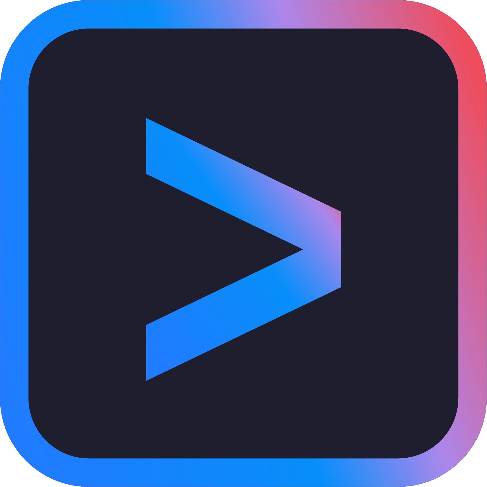

<h1 align="center">ai-agent-notifier</h1>

<p align="center">
  <strong>Desktop & phone notifications for AI coding agents</strong><br />
  One tool. One config. Every agent. Never miss when your AI finishes or needs input.
</p>

<p align="center">
  &nbsp;&nbsp;
  &nbsp;&nbsp;
  &nbsp;&nbsp;
  &nbsp;&nbsp;
  
</p>

<p align="center">
  <a href="https://www.npmjs.com/package/ai-agent-notifier"></a>
  <a href="https://www.npmjs.com/package/ai-agent-notifier"></a>
  <a href="https://github.com/DevinoSolutions/ai-agent-notifier/blob/main/LICENSE"></a>
  <a href="https://nodejs.org">= 18" /></a>
  
</p>

<p align="center">
  
  
  
  
  
</p>

---

## Demo

https://github.com/user-attachments/assets/5714b528-7e04-478e-abfd-2a3d05db562c

[Watch with sound on YouTube](https://www.youtube.com/watch?v=QVVOIIud4-I)

## Quick Start

```bash
npx ai-agent-notifier setup
```

That's it. The setup wizard detects your platform and installed AI tools, wires the hooks, and optionally configures phone push notifications. Restart your AI tools to activate.

## Features

- **Desktop toast notifications** -- Windows (BurntToast), macOS (Notification Center), Linux (libnotify)
- **WSL-native toasts** -- real Windows toast notifications from inside WSL, no Linux notification daemon needed
- **Phone push notifications** -- Android & iOS via [ntfy](https://ntfy.sh) (free, no account required)
- **Webhook notifications** -- Slack, Discord, Telegram, or any HTTP endpoint, with an optional auth header
- **Rich notification content** -- Claude Code toasts and webhooks show what the agent actually said or asked, not a generic line
- **Terminal bell** -- audible ding in the terminal that launched the agent (works over SSH/tmux)
- **Click-to-focus** -- click the toast to jump back to the terminal or VS Code window (Windows)
- **Codex approval alerts** -- get notified the instant Codex asks for permission, not just when it finishes
- **Per-tool branded icons** -- each tool gets its own logo in the notification
- **One unified config** -- shared `~/.ai-agent-notifier/config.json` across all tools
- **Atomic deduplication** -- prevents double notifications (e.g. Cursor's duplicate hook fires)
- **Zero dependencies** -- pure Node.js built-ins only, no npm production packages

## Supported Tools

<table>
  <tr>
    <th>Tool</th>
    <th>VS Code</th>
    <th>CLI</th>
    <th>Task Complete</th>
    <th>Needs Input</th>
  </tr>
  <tr>
    <td>&nbsp; <strong>Claude Code</strong></td>
    <td align="center">Native</td>
    <td align="center">Native</td>
    <td><code>Stop</code></td>
    <td><code>Notification</code></td>
  </tr>
  <tr>
    <td>&nbsp; <strong>Codex CLI</strong></td>
    <td align="center">Native</td>
    <td align="center">Native</td>
    <td><code>Stop</code></td>
    <td><code>PermissionRequest</code></td>
  </tr>
  <tr>
    <td>&nbsp; <strong>Cursor</strong></td>
    <td align="center">Native</td>
    <td align="center">--</td>
    <td><code>stop</code></td>
    <td>--</td>
  </tr>
  <tr>
    <td>&nbsp; <strong>Gemini CLI</strong></td>
    <td align="center">--</td>
    <td align="center">Native</td>
    <td><code>AfterAgent</code></td>
    <td><code>Notification</code></td>
  </tr>
</table>

All four tools are wired automatically by the setup wizard. No manual config editing needed. Codex's `PermissionRequest` hook fires the same "needs your input" alert when Codex asks for approval to run a command -- verified with Codex CLI >=0.144.0.

### VS Code Native Support

Claude Code, Codex, and Cursor all run inside VS Code. **ai-agent-notifier** hooks directly into each tool's native hook system -- no VS Code extension required. The setup wizard detects installed tools and patches their configs automatically. Click a notification toast to jump straight back to your VS Code window.

## Installation

### npm (recommended)

```bash
# One-shot setup (no install needed)
npx ai-agent-notifier setup

# Or install globally
npm i -g ai-agent-notifier
ai-agent-notifier setup
```

### Claude Code Plugin

```
/install-plugin https://github.com/DevinoSolutions/ai-agent-notifier
```

Hooks auto-register. Use `/ai-agent-notifier:setup` to wire other tools.

### Standalone (no npm)

**Windows (PowerShell):**
```powershell
irm https://raw.githubusercontent.com/DevinoSolutions/ai-agent-notifier/main/setup/install.ps1 | iex
```

**macOS / Linux:**
```bash
curl -fsSL https://raw.githubusercontent.com/DevinoSolutions/ai-agent-notifier/main/setup/install.sh | bash
```

## CLI Commands

```
ai-agent-notifier setup          # First-time setup wizard
ai-agent-notifier status         # Show wired tools, config, backends
ai-agent-notifier test [channel] # Fire test notification (toast | ntfy | webhook | bell | both)
ai-agent-notifier config         # Interactive settings menu
ai-agent-notifier uninstall      # Remove hooks from all tools
```

## Configuration

Config lives at `~/.ai-agent-notifier/config.json`:

```json
{
  "ntfy": {
    "enabled": true,
    "server": "https://ntfy.sh",
    "topic": "ai-agent-notifier-<random>",
    "click": ""
  },
  "toast": {
    "enabled": true,
    "clickToFocus": true
  },
  "terminalBell": {
    "enabled": true
  },
  "webhook": {
    "enabled": false,
    "url": "",
    "format": "generic"
  },
  "sentry": {
    "enabled": false,
    "dsn": ""
  },
  "events": {
    "task_complete": { "toastSound": "IM", "priority": "default" },
    "needs_input": { "toastSound": "Reminder", "priority": "urgent" },
    "session_start": { "toastSound": "Default", "priority": "low", "terminalBellEnabled": false }
  }
}
```

`ntfy.click` is the URL opened when you tap a phone notification (empty = no link). `terminalBell` rings the terminal that launched the agent -- for Claude Code (>=2.1.141) it rings through Claude Code's own terminal write path (hook JSON `terminalSequence`), which is safe in tmux, GNU screen, and on Windows per Claude Code's docs; other agents get a direct TTY/console bell. `webhook` posts to Slack, Discord, Telegram, or any URL (see below). `sentry` is opt-in error reporting (see [Error visibility](#error-visibility)). Per-event `toastSound` names a Windows [BurntToast](https://github.com/Windos/BurntToast) sound; on macOS the name is mapped to the closest built-in system sound (Windows names like `IM`/`Reminder` are translated, and `Default` or unrecognized names fall back to the system default), while on Linux it is ignored; `priority` (`min` / `low` / `default` / `high` / `urgent`) drives both the ntfy push priority and the Linux `notify-send` urgency.

### ntfy -- Phone Push Notifications

[ntfy](https://ntfy.sh) sends free push notifications to your phone -- no account needed.

1. Install the ntfy app ([Android](https://play.google.com/store/apps/details?id=io.heckel.ntfy) / [iOS](https://apps.apple.com/app/ntfy/id1625396347))
2. Subscribe to your topic (shown during setup)
3. All your AI tools' notifications appear in one stream

### Webhook -- Slack, Discord, Telegram, or anything

Set `webhook.enabled: true` and a `webhook.url` to POST a notification to any HTTP endpoint. `format` selects the payload shape:

**Slack:**
```json
{
  "webhook": {
    "enabled": true,
    "url": "https://hooks.slack.com/services/...",
    "format": "slack"
  }
}
```

**Discord:**
```json
{
  "webhook": {
    "enabled": true,
    "url": "https://discord.com/api/webhooks/...",
    "format": "discord"
  }
}
```

**Telegram:**
```json
{
  "webhook": {
    "enabled": true,
    "url": "https://api.telegram.org/bot<token>/sendMessage",
    "format": "telegram",
    "chatId": "123456789"
  }
}
```

**Generic (anything else):**
```json
{
  "webhook": {
    "enabled": true,
    "url": "https://example.com/hook",
    "format": "generic",
    "authorization": "Bearer <token>"
  }
}
```
Generic POSTs `{title, message, source, project, event, timestamp}` as JSON. `authorization`, if set, is sent as the `Authorization` header for any format, not just generic.

Webhook failures are logged with the URL's origin only, never the full URL -- a Slack/Discord webhook URL or a Telegram bot token is a secret, and errors.log can be mirrored to Sentry.

Test it with `ai-agent-notifier test webhook`, or turn it off for one event type with `"events": {"task_complete": {"webhookEnabled": false}}`.

### Rich notification content

For Claude Code, toast and webhook notifications show what actually happened instead of a generic "task complete" line: a "needs input" notification carries Claude's own question, and a "task complete" notification carries the last assistant message, both read from the Claude Code transcript and trimmed to a short snippet. Session-start notifications stay generic (nothing to show yet). Other agents (Codex, Cursor, Gemini) always get the generic text -- transcript reading is Claude Code-only.

Controlled per channel:

| Channel | Config key | Default |
|---------|-----------|:-------:|
| Toast | `toast.richContent` | `true` |
| Webhook | `webhook.richContent` | `true` |
| ntfy | `ntfy.richContent` | `false` |

`ntfy.richContent` defaults to **false** for privacy: the default `ntfy.sh` server is public, ntfy topic names are guessable rather than access-controlled secrets, and a snippet of your conversation would leak to anyone who guesses or stumbles on your topic. Only enable `ntfy.richContent` if you run your own private ntfy server, or you've deliberately accepted that risk on the public one.

### Per-Event Settings

| Event | Default `toastSound` | Default `priority` | Description |
|-------|:------------:|:-------------:|-------------|
| `task_complete` | IM | default | Agent finished its task |
| `needs_input` | Reminder | urgent | Agent needs your input or permission |
| `session_start` | Default | low | New session started (all channels off by default) |

### Error visibility

Hook and channel errors never interrupt your agent -- they're appended to `~/.ai-agent-notifier/errors.log` and surfaced by `npx ai-agent-notifier status`, so a misconfigured toast backend or unreachable ntfy topic shows up as a logged error instead of a silent no-op. Set `sentry.enabled` to `true` (with a `sentry.dsn`) to also mirror those errors to [Sentry](https://sentry.io) through a built-in, zero-dependency envelope client: no SDK is bundled, no telemetry is collected, and nothing leaves your machine unless you opt in -- only error data is sent.

## How It Works

Each AI tool's hook system pipes event data to `notify.mjs`:

```
Hook fires (stdin JSON + --source flag)
  -> parse-input.mjs   (normalize across tools)
  -> router.mjs        (map event to notification type)
  -> transcript.mjs    (Claude Code only: derive rich message text)
  -> platform toast    (Windows / macOS / Linux / WSL)
  -> ntfy push         (phone notification)
  -> webhook POST      (Slack / Discord / Telegram / generic)
  -> terminal bell     (Claude Code: terminalSequence in the hook reply;
                        other tools: BEL to the controlling terminal)
```

## Platform Details

### Windows

- [BurntToast](https://github.com/Windos/BurntToast) PowerShell module for rich toast notifications
- Click-to-focus via custom `agentfocus://` URI protocol
- BurntToast auto-installed during setup if missing
- Requires PowerShell 7+ (pwsh)

### macOS

- Uses built-in `osascript` -- zero additional dependencies
- Falls back to `terminal-notifier` for richer features if available

### Linux

- Uses `notify-send` (libnotify) -- available on most desktop distributions
- Fails silently on headless systems without a GUI (see WSL below for WSL2)

### WSL

- Auto-detected -- no config needed
- Toast notifications route to a real Windows toast via PowerShell interop (`powershell.exe`/`pwsh.exe` across the `/mnt/c` boundary), not `notify-send`/D-Bus
- Needs WSL2 interop enabled and a Windows PowerShell present -- both are on by default
- Terminal bell and ntfy behave exactly as on native Linux

## Requirements

| Requirement | Details |
|-------------|---------|
| **Node.js** | >= 18.0.0 (already present for all supported AI tools) |
| **Windows** | PowerShell 7+ (pwsh) |
| **macOS** | osascript (built-in) |
| **Linux** | notify-send (optional, for desktop toasts) |

## Uninstall

```bash
ai-agent-notifier uninstall
```

Removes all managed hooks from every tool's config. Original configs are backed up at `~/.ai-agent-notifier/backups/`.

## Testing

Everything below is verified against the **real thing** — no mocks, no stubs, no fakes. Real ntfy.sh push delivery, a real Linux notification daemon receiving the exact payload, the real agent CLIs installed from npm and driven end to end, and the real native OS toast backends firing — then **read back out of the OS's own notification store** (`dunst` on Linux, Notification Center's database on macOS, `wpndatabase.db` on Windows) to prove the payload actually landed, not just that the call returned 0. Every job is **required** and **hard-fails**: a broken key, a renamed secret, or a hook that doesn't deliver turns CI red instead of skipping silently.

### What CI verifies on every run — all real, all platforms

Each job runs as its own GitHub Actions workflow. The badge in every row is its **live status on `main`** — not a screenshot — so click any badge to see the actual run and its per-test logs.

<table>
  <thead>
    <tr>
      <th>Job</th>
      <th align="center" width="180">Live status</th>
      <th>Platforms</th>
      <th>What is actually exercised (no mocks)</th>
    </tr>
  </thead>
  <tbody>
    <tr>
      <td><strong>Unit</strong></td>
      <td align="center"><a href="https://github.com/DevinoSolutions/ai-agent-notifier/actions/workflows/unit.yml"></a></td>
      <td>Linux · macOS · Windows</td>
      <td>The full unit + integration suite against the real exported code (not inline copies)</td>
    </tr>
    <tr>
      <td><strong>E2E real-world</strong></td>
      <td align="center"><a href="https://github.com/DevinoSolutions/ai-agent-notifier/actions/workflows/e2e.yml"></a></td>
      <td>Linux · macOS · Windows</td>
      <td>Real <code>setup</code>/<code>uninstall</code> subprocesses against an isolated HOME · real <code>notify.mjs</code> hook invocation per source · <strong>real ntfy.sh round-trip</strong> (push sent, then read back off the server)</td>
    </tr>
    <tr>
      <td><strong>Install + smoke-load</strong></td>
      <td align="center"><a href="https://github.com/DevinoSolutions/ai-agent-notifier/actions/workflows/agents.yml"></a></td>
      <td>Linux · macOS · Windows</td>
      <td>Installs the <strong>real</strong> Claude, Codex, Gemini (and Cursor where available) CLIs from npm, asserts they launch, and smoke-loads each hook (Codex classification pinned — drift fails CI)</td>
    </tr>
    <tr>
      <td><strong>Live Claude</strong></td>
      <td align="center"><a href="https://github.com/DevinoSolutions/ai-agent-notifier/actions/workflows/live-claude.yml"></a></td>
      <td>Linux · macOS</td>
      <td>Drives the <strong>real</strong> Claude CLI end to end (paid); <strong>hard-fails</strong> if the Stop hook doesn't deliver a real ntfy push · on macOS it also does a <strong>best-effort</strong> Notification Center read-back (logged, non-blocking — the hard osascript→NC delivery proof is the dedicated Toast macOS lane)</td>
    </tr>
    <tr>
      <td><strong>Live Gemini</strong></td>
      <td align="center"><a href="https://github.com/DevinoSolutions/ai-agent-notifier/actions/workflows/live-gemini.yml"></a></td>
      <td>Linux · macOS</td>
      <td>Drives the <strong>real</strong> Gemini CLI end to end; <strong>hard-fails</strong> if the hook doesn't deliver a real ntfy push · on macOS it also does a <strong>best-effort</strong> Notification Center read-back (logged, non-blocking — the hard NC delivery proof is the dedicated Toast macOS lane)</td>
    </tr>
    <tr>
      <td><strong>Live Codex</strong></td>
      <td align="center"><a href="https://github.com/DevinoSolutions/ai-agent-notifier/actions/workflows/live-codex.yml"></a></td>
      <td>Linux · macOS</td>
      <td>Validates <code>OPENAI_API_KEY</code> against the <strong>live OpenAI API</strong>, boots the real Codex config + PermissionRequest hook wiring, and drives a <strong>real completed <code>codex exec</code> turn</strong> (asserts it echoes a unique token) ¹</td>
    </tr>
    <tr>
      <td><strong>Live Cursor</strong></td>
      <td align="center"><a href="https://github.com/DevinoSolutions/ai-agent-notifier/actions/workflows/live-cursor.yml"></a></td>
      <td>Linux</td>
      <td>Validates the real Cursor config-patch wiring (BYO key) ¹</td>
    </tr>
    <tr>
      <td><strong>TUI Proofs</strong></td>
      <td align="center"><a href="https://github.com/DevinoSolutions/ai-agent-notifier/actions/workflows/tui-proofs.yml"></a></td>
      <td>macOS</td>
      <td>Drives the <strong>real</strong> Claude and Codex TUIs in a live <code>tmux</code> session. <strong>F1</strong>: the Claude terminal <strong>bell</strong> sets tmux's <code>window_bell_flag</code>. <strong>F2</strong>: a <strong>real Codex approval modal</strong> appears, our PermissionRequest notification fires, we approve via send-keys, and the guarded command runs — the full approval decision loop that <code>codex exec</code> structurally can't exercise</td>
    </tr>
    <tr>
      <td><strong>Live Toast Linux</strong></td>
      <td align="center"><a href="https://github.com/DevinoSolutions/ai-agent-notifier/actions/workflows/toast-linux.yml"></a></td>
      <td>Linux</td>
      <td>Fires through the real <code>notify-send</code> backend into a <strong>real <code>dunst</code> daemon</strong>, then reads its history and asserts it captured the exact title + body — and goes one layer further, proving the notification is <strong>rendered on-screen</strong>: it captures the X display and reads the banner's text back with OCR (nonce present in a during-display frame, absent from the pre-fire frame) ²</td>
    </tr>
    <tr>
      <td><strong>Live Toast macOS</strong><br/>(delivery capture)</td>
      <td align="center"><a href="https://github.com/DevinoSolutions/ai-agent-notifier/actions/workflows/toast-macos.yml"></a></td>
      <td>macOS</td>
      <td>Fires the <strong>real</strong> <code>osascript</code> backend, then <strong>reads the delivery back out of Notification Center's own SQLite DB</strong> and asserts the exact payload was recorded — so it fails when a real user would have seen nothing (the silent-drop an exit-code check misses). Also runs <code>aan doctor --deep</code> as an independent second check</td>
    </tr>
    <tr>
      <td><strong>Live Toast Native</strong></td>
      <td align="center"><a href="https://github.com/DevinoSolutions/ai-agent-notifier/actions/workflows/toast-native.yml"></a></td>
      <td>Windows</td>
      <td>Fires the <strong>real</strong> BurntToast backend, then <strong>reads the notification back out of the Windows notification platform's own store</strong> (<code>wpndatabase.db</code>) and asserts the exact nonce was recorded in the toast's title <strong>and</strong> body — so it fails when a real user would have seen nothing (the silent-drop an exit-code check misses) ³</td>
    </tr>
  </tbody>
</table>

¹ The Live Codex lane completes a real `codex exec` turn, but non-interactive exec structurally can't exercise the **approval decision loop** — with no TTY, codex forces `approval: never` + a read-only sandbox, so the PermissionRequest hook never fires. That loop is proven end to end by the **TUI Proofs** lane (F2), which drives the interactive TUI. Cursor is a GUI editor (BYO key), so its lane validates the live key + real config wiring; its hook **delivery** is fully covered by the unit + e2e suites.

² The on-screen render proof draws the banner with **our** tuned `dunstrc` (large mono font, high contrast) on a **virtual** X display (Xvfb), so it proves the product path renders legible, machine-readable pixels — not that every user's desktop theme renders identically. macOS has no equivalent lane: on the hosted runner a real notification records in Notification Center but never presents a banner, and the accessibility/screen-capture routes are walled off by TCC, so **layer 2 (recorded in Notification Center) is the honest macOS CI ceiling** — on-screen rendering there is a real-machine concern checked by `aan doctor --deep`. See [`docs/research/2026-07-15-layer3-render-proof.md`](docs/research/2026-07-15-layer3-render-proof.md).

³ Like macOS, Windows is proven to **layer 2** in CI: the hosted `windows-latest` runner is a headless Session-0 environment with no interactive desktop, so the toast is **recorded** by the Windows notification platform but no banner is presented on a screen. The gate reads the record back out of `wpndatabase.db` (WAL-aware — a freshly fired toast lives in the DB's write-ahead log, so an `immutable=1` open would miss it and falsely report absence) and asserts the exact nonce in the title and body. On-screen rendering is a real-machine concern checked by `aan doctor` (PowerShell + BurntToast + execution-policy state). See [`docs/research/2026-07-15-layer3-render-proof.md`](docs/research/2026-07-15-layer3-render-proof.md).

### Run it yourself

```bash
npm test            # offline: the full unit + integration suite
npm run test:e2e    # real ntfy.sh round-trip, needs network
npm run toast:demo  # fire real desktop toasts, every event
```

### The one thing CI can't prove

CI goes further than "the call returned 0." On **Linux** it reads the payload back out of a real `dunst` daemon **and** captures the X display to OCR the banner's text off the screen — pixels, not just a database row. On **macOS** it reads the delivery back out of Notification Center's own database, and on **Windows** out of the notification platform's `wpndatabase.db` — so a notification that was silently dropped for lack of permission records nothing and turns CI **red** instead of green. What no headless runner can prove is the last millimetre: a human's eyes actually seeing the banner. On macOS and Windows the on-screen banner can't be captured in CI at all (the hosted runner records the notification but never presents it — layer 2 is the ceiling ² ³), and everywhere Do Not Disturb / Focus can suppress the on-screen banner while the notification is still recorded as delivered. So "reached the notification store" is not always "a person saw it." To confirm with your own eyes — and to check your own machine's notification permission — run `npm run toast:demo` and `aan doctor --deep`.

## Contributing

Contributions are welcome. Please open an issue first to discuss what you'd like to change.

## License

[AGPL-3.0](LICENSE) -- Copyright (c) 2026 [DevinoSolutions](https://github.com/DevinoSolutions)
